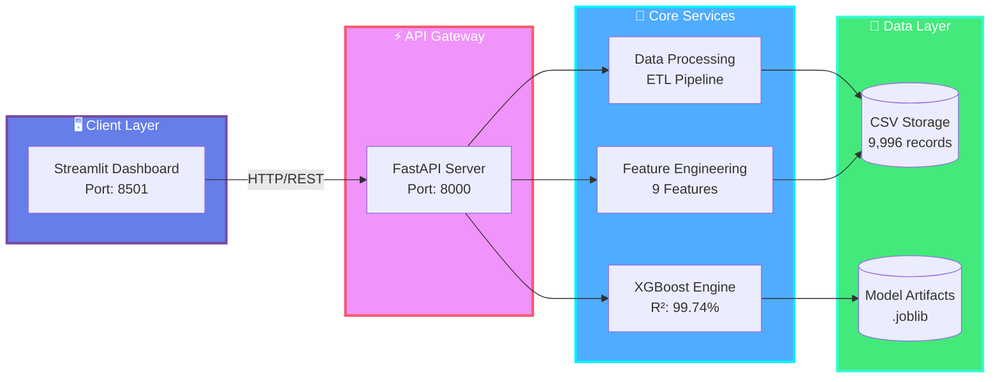

<div align="center">

# � DMart Analytics Intelligence

### AI-Powered E-Commerce Analytics & Sales Prediction Platform

[](https://www.python.org/)
[](https://fastapi.tiangolo.com/)
[](https://streamlit.io/)
[](https://xgboost.readthedocs.io/)

**99.74% Accuracy** • **Real-time Predictions** • **Interactive Dashboards**

[Getting Started](#-quick-start) • [Features](#-features) • [Architecture](#-architecture) • [Documentation](#-documentation)

</div>

---

## ✨ Features

<table>
<tr>
<td width="50%">

### 🎯 Core Capabilities
- **AI Sales Forecasting** with 99.74% R² accuracy
- **Real-time Analytics** dashboard
- **Anomaly Detection** for unusual patterns
- **Multi-dimensional Insights** (category, region, time)
- **Confidence Intervals** for predictions

</td>
<td width="50%">

### 🎨 User Experience
- **Interactive Visualizations** with Plotly
- **Gradient UI Design** for modern aesthetics
- **INR Currency Support** with smart formatting
- **Responsive Layouts** for all screen sizes
- **One-click Predictions** with instant results

</td>
</tr>
</table>

---

## 🏗 Architecture



<div align="center">

### � Data Flow Pipeline

```
Raw Data (CSV) → Cleaning & Validation → Feature Engineering → XGBoost Model → Predictions → Dashboard
     ↓               ↓                         ↓                    ↓              ↓           ↓
  9,996 rows    De-duplication         9 Features Created      Training      API Response   Plotly Charts
```

</div>

---

## 🚀 Quick Start

### Prerequisites
- Python 3.8 or higher
- pip package manager

### Installation & Launch

```bash
# 1️⃣ Install dependencies
pip install -r requirements.txt

# 2️⃣ Start API server (Terminal 1)
cd api
uvicorn main:app --reload --port 8000

# 3️⃣ Launch dashboard (Terminal 2)
streamlit run src/app.py
```

**🎉 Done!** Access the dashboard at [http://localhost:8501](http://localhost:8501)

### ☁️ Deploy to Streamlit Cloud

```bash
# 1️⃣ Push to GitHub
git add .
git commit -m "Deploy to Streamlit Cloud"
git push origin main

# 2️⃣ Go to share.streamlit.io
# 3️⃣ Connect your GitHub repo
# 4️⃣ Set main file: src/app.py
# 5️⃣ Click Deploy!
```

**📖 Detailed deployment guide:** [DEPLOYMENT.md](DEPLOYMENT.md)

---

## � Project Structure

```
📦 DMart Analytics
├── 🎨 src/
│   ├── app.py              # Streamlit dashboard
│   ├── data_processor.py   # ETL pipeline
│   ├── model_trainer.py    # ML training
│   └── monitoring.py       # System health
├── ⚡ api/
│   ├── main.py            # FastAPI endpoints
│   └── test_api.py        # API tests
├── 📊 data/
│   └── DMart_Grocery_Sales_-_Retail_Analytics_Dataset.csv
├── 🤖 models/
│   └── trained/           # XGBoost models (.joblib)
├── 🧪 tests/
│   ├── test_data_processor.py
│   └── test_model_trainer.py
└── 📋 requirements.txt
```

---

## 🔧 Configuration

Set environment variables or use `.env` file:

```env
DATA_PATH=data/DMart_Grocery_Sales_-_Retail_Analytics_Dataset.csv
API_PORT=8000
DEBUG_MODE=True
```

**Data Location Priority:**
1. Workspace `data/` folder
2. `DATA_PATH` environment variable
3. Current working directory
4. File uploader (Streamlit fallback)

---

## 🧪 Testing

```bash
# Run all tests
pytest

# With coverage
pytest --cov=src --cov-report=term-missing

# Specific test
pytest tests/test_data_processor.py -v
```

---

## 🎯 API Endpoints

| Endpoint | Method | Description |
|----------|--------|-------------|
| `/predict` | POST | Generate sales predictions |
| `/metrics/{category}` | GET | Category-wise metrics |
| `/health` | GET | API health check |

**Example Request:**
```bash
curl -X POST http://localhost:8000/predict \
  -H "Content-Type: application/json" \
  -d '{
    "category": "Electronics",
    "region": "North",
    "date": "2025-12-01",
    "discount": 0.10
  }'
```

---

## 📈 Model Performance

| Metric | Value |
|--------|-------|
| **R² Score** | 99.74% |
| **MAPE** | 1.84% |
| **Algorithm** | XGBoost Regressor |
| **Features** | 9 engineered |
| **Training Samples** | 9,996 |

---

## 🛠 Tech Stack

<div align="center">

| Layer | Technologies |
|-------|-------------|
| **Frontend** | Streamlit • Plotly • HTML/CSS |
| **Backend** | FastAPI • Uvicorn • Pydantic |
| **ML/Data** | XGBoost • Scikit-learn • Pandas • NumPy |
| **Storage** | CSV • Joblib |
| **Testing** | Pytest • Coverage.py |

</div>

---

## 📚 Documentation

- **[Software Technologies](SOFTWARE_TECHNOLOGIES.md)** - Detailed tech stack documentation
- **[API Documentation](http://localhost:8000/docs)** - Interactive API docs (when server running)

---

## 🤝 Contributing

Contributions are welcome! Please follow these steps:

1. Fork the repository
2. Create a feature branch (`git checkout -b feature/amazing-feature`)
3. Commit changes (`git commit -m 'Add amazing feature'`)
4. Push to branch (`git push origin feature/amazing-feature`)
5. Open a Pull Request

---

## 📝 License

This project is licensed under the **MIT License**.

---

<div align="center">

### 🌟 Built with ❤️ using Modern Python Stack

**Version 1.0.0** • Last Updated: November 2025

Made by [himayath07](https://github.com/himayath07)

[⬆ Back to Top](#-dmart-analytics-intelligence)

</div>