# 🚀 DMart Analytics Intelligence Platform

A comprehensive e-commerce analytics and prediction platform powered by XGBoost ML.

## 📊 System Architecture

```mermaid
graph TB
    subgraph Frontend["Frontend Layer (Streamlit)"]
        A1[Sales Dashboard]
        A2[Forecasting Interface]
        A3[Analytics Views]
        A4[Alert Center]
    end

    subgraph Backend["Backend Services (FastAPI)"]
        B1[Data Pipeline ETL]
        B2[Feature Engineering]
        B3[Model Training]
        B4[Prediction API]
        B5[Monitoring Service]
    end

    subgraph DataLayer["Data Layer"]
        C1[Raw Data Storage]
        C2[Feature Store]
        C3[Model Artifacts]
        C4[(Database)]
    end

    subgraph ML["ML Components"]
        D1[XGBoost Model]
        D2[Feature Processor]
        D3[Model Evaluator]
    end

    %% Frontend to Backend connections
    A1 --> B4
    A2 --> B4
    A3 --> B4
    A4 --> B5

    %% Backend internal connections
    B1 --> B2
    B2 --> B3
    B3 --> B4
    B4 --> B5

    %% Backend to Data Layer connections
    B1 --> C1
    B2 --> C2
    B3 --> C3
    B4 --> C4

    %% ML connections
    B3 --> D1
    B2 --> D2
    D1 --> D3
    D3 --> B5

    style Frontend fill:#6667AB,stroke:#fff,stroke-width:2px
    style Backend fill:#4B5563,stroke:#fff,stroke-width:2px
    style DataLayer fill:#1F2937,stroke:#fff,stroke-width:2px
    style ML fill:#374151,stroke:#fff,stroke-width:2px
```



## 🔑 Key Features

- ✅ **Real-time Sales Predictions** - XGBoost ML model with 99.74% accuracy
- ✅ **Interactive Dashboards** - Beautiful UI with gradient designs
- ✅ **Multi-dimensional Analytics** - Category, region, time-based insights
- ✅ **Anomaly Detection** - Automatic detection of unusual patterns
- ✅ **INR Currency Support** - All values displayed in Indian Rupees
- ✅ **Confidence Intervals** - Prediction ranges for better decision making
- ✅ **Historical Analysis** - Trend analysis and growth tracking

## 🚀 Quick Start Guide

### 📦 Step 1: Extract & Setup

1. Extract the ZIP file to your desired location
2. Open Command Prompt/PowerShell
3. Navigate to the project:
```bash
cd path/to/ecommerce_analytics
```

### 🔧 Step 2: Install Dependencies

```bash
pip install -r requirements.txt
```

**Core Dependencies:**
- pandas
- numpy
- scikit-learn
- xgboost
- fastapi
- uvicorn
- streamlit
- plotly
- joblib
- requests

### 🗄️ Step 3: Initialize Database (Optional)

```bash
python scripts/init_db.py
```

### 🤖 Step 4: Train Model (Optional)

```bash
python scripts/train_model.py
```

### 🌐 Step 5: Launch Application

**Terminal 1 - API Server:**
```bash
cd api
python -m uvicorn main:app --reload --host 0.0.0.0 --port 8000
```

**Terminal 2 - Dashboard:**
```bash
cd ecommerce_analytics
streamlit run src/app.py
```

Access at: http://localhost:8501

## Development

### Running Tests
```bash
pytest tests/
```

### Code Quality
```bash
# Run linting
flake8 .

# Run type checking
mypy .
```

## 📁 Project Structure

```
ecommerce_analytics/
├── api/
│   ├── main.py                 # FastAPI backend
│   └── test_api.py            # API tests
├── data/
│   └── DMart_Grocery_Sales_-_Retail_Analytics_Dataset.csv
├── models/
│   └── trained/               # Pre-trained XGBoost models
├── scripts/
│   ├── init_db.py            # Database initialization
│   └── train_model.py        # Model training script
├── src/
│   ├── app.py                # Streamlit dashboard
│   ├── data_processor.py     # Data processing
│   ├── model_trainer.py      # Model training
│   └── monitoring.py         # System monitoring
├── tests/
│   ├── test_data_processor.py
│   └── test_model_trainer.py
└── requirements.txt          # Dependencies
```

## 🔬 Technical Details

### Model Information
- **Algorithm:** XGBoost Regressor
- **Accuracy:** 99.74% R² Score
- **Error Rate:** 1.84% MAPE
- **Features:** 9 engineered features
- **Training Data:** 9,996 records
- **Last Updated:** October 11, 2025

### API Endpoints
- `/predict`: Generate sales predictions
- `/metrics/{category}`: Category metrics
- `/health`: API health check

### Configuration
Key settings in `.env`:
```ini
API_PORT=8000
DEBUG_MODE=True
MODEL_PATH=models/sales_prediction_model.joblib
DATA_PATH=data/sales_data.csv
```

## 🐛 Troubleshooting Guide

### Port Conflicts
**Port 8000:**
```bash
# Windows
netstat -ano | findstr :8000
taskkill /PID <PID_NUMBER> /F

# Mac/Linux
lsof -ti:8000 | xargs kill -9
```

**Port 8501:**
```bash
# Windows
netstat -ano | findstr :8501
taskkill /PID <PID_NUMBER> /F

# Mac/Linux
lsof -ti:8501 | xargs kill -9
```

### Common Issues & Solutions
1. **Module not found:**
   ```bash
   pip install --upgrade -r requirements.txt
   ```

2. **Model not found:**
   ```bash
   python scripts/train_model.py
   ```

3. **API Connection Issues:**
   - Verify API server (port 8000)
   - Check http://localhost:8000/health
   - Restart API server

4. **No Data Available:**
   - Verify CSV file in `data/`
   - Check file paths
   - Adjust date filters

## 🤝 Contributing

1. Fork repository
2. Create feature branch
3. Implement changes
4. Run tests
5. Submit pull request

## 📝 License

This project is licensed under the MIT License.

---

**Version:** 1.0.0  
**Last Updated:** October 2025  
**Built with:** Python • FastAPI • Streamlit • XGBoost • Plotly